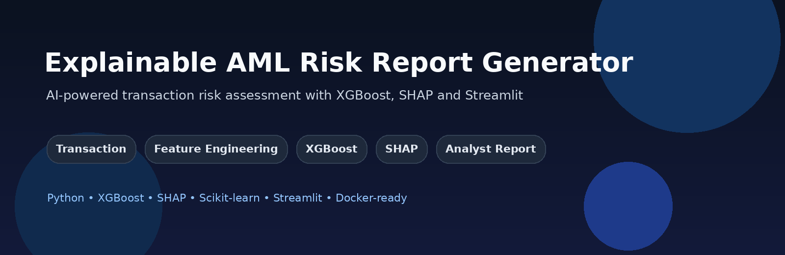
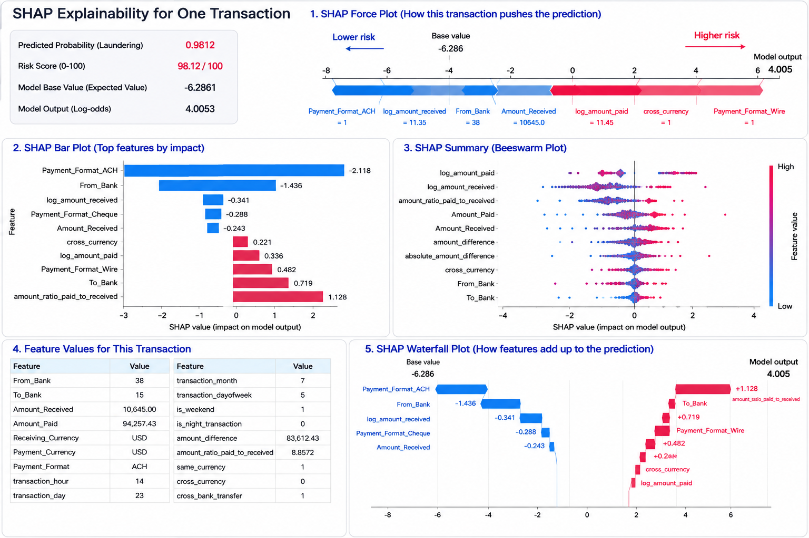
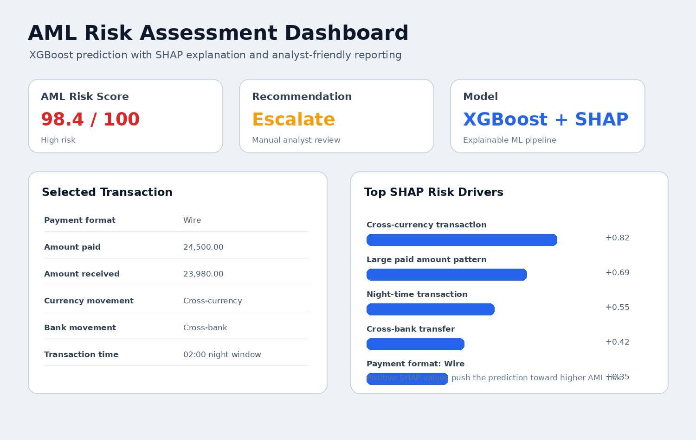
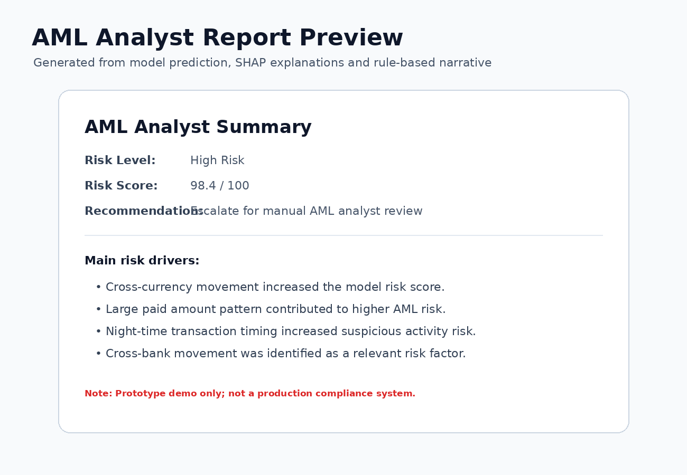
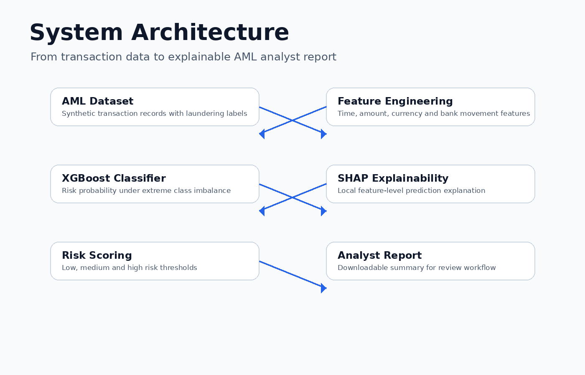

<div align="center">



# 🏦 Explainable AML Risk Report Generator

**AI-powered Anti-Money Laundering risk assessment using XGBoost, SHAP and Streamlit**

[]()
[]()
[]()
[]()
[]()

</div>

---

## 📸 Demo Preview



---

## 🚀 Demo Overview

This project is a lightweight end-to-end machine learning demo for **Anti-Money Laundering (AML) transaction risk scoring**.

The app allows a user to select a transaction and generate:

- 🧠 AML risk probability using an XGBoost classifier
- 🟢🟡🔴 Low / Medium / High risk category
- 🔍 SHAP-based local prediction explanation
- 📊 visual risk-driver chart
- 📄 downloadable analyst-style AML report

> ⚠️ This is a portfolio/demo project and not a production AML compliance system.

---

## 📸 Demo Preview

### 🖥️ Streamlit Dashboard



### 🔍 SHAP Explainability


### 📄 Analyst Report Preview



---

## ✨ Key Features

- ✅ XGBoost classifier for suspicious transaction risk prediction
- ✅ AML-inspired feature engineering
- ✅ class imbalance handling using `scale_pos_weight`
- ✅ ROC-AUC and PR-AUC evaluation
- ✅ threshold analysis for operational risk scoring
- ✅ SHAP explanations for individual predictions
- ✅ human-readable explanation mapping
- ✅ Streamlit dashboard
- ✅ downloadable analyst-style report
- 🔜 RAG-based AML guidance retrieval
- 🔜 LLM-generated analyst report
- 🔜 Docker and Hugging Face Spaces deployment

---

## ⚙️ System Architecture



```text
Transaction
    ↓
Feature Engineering
    ↓
XGBoost Classifier
    ↓
Risk Score + Thresholding
    ↓
SHAP Explainability
    ↓
Analyst-Friendly Report
    ↓
Streamlit Dashboard
```

---

## 📁 Project Structure

```text
aml-risk-report-generator/
│
├── app.py
├── train_model.py
├── train_model_v2.py
├── test_explainability.py
├── requirements.txt
├── README.md
├── .gitignore
│
├── data/
│   ├── .gitkeep
│   ├── sample_app_inputs_v2.csv      # ignored in Git
│   └── [dataset CSV file]            # ignored in Git
│
├── models/
│   ├── .gitkeep
│   ├── xgb_aml_pipeline_v2.pkl       # ignored in Git
│   └── feature_info_v2.pkl           # ignored in Git
│
├── screenshots/
│   ├── hero_banner.png
│   ├── dashboard_preview.png
│   ├── shap_explanation.png
│   ├── report_preview.png
│   └── architecture.png
│
└── utils/
    ├── __init__.py
    ├── feature_engineering.py
    └── explainability.py
```

---

## 💾 Dataset

This project uses a synthetic AML transaction dataset from **IBM AML-Data**.

The dataset includes transaction-level information such as:

- timestamp
- originating bank
- receiving bank
- amount paid
- amount received
- payment currency
- receiving currency
- payment format
- laundering label

The supervised target column is:

```text
Is_Laundering
```

---

## 🛠️ Feature Engineering

The improved model uses AML-inspired engineered features rather than relying only on raw transaction fields.

### ⏰ Time Features

- transaction hour
- transaction day
- transaction month
- transaction day of week
- weekend flag
- night transaction flag

### 💰 Amount Features

- amount difference
- absolute amount difference
- paid-to-received amount ratio
- log amount paid
- log amount received

### 🌍 Currency & Bank Movement Features

- same currency flag
- cross-currency flag
- same-bank transfer flag
- cross-bank transfer flag

### 🔒 Leakage Reduction

Account identifiers and raw timestamps are excluded from the final model feature set to reduce memorization and improve generalization.

---

## 📊 Model Performance

The first baseline model achieved high ROC-AUC but weak PR-AUC because the dataset is extremely imbalanced.

| Metric | Baseline Model | Feature-Engineered Model |
|---|---:|---:|
| ROC-AUC | 0.9664 | **0.9712** |
| PR-AUC | 0.0480 | **0.2273** |

The engineered model improved PR-AUC from:

```text
0.0480 → 0.2273
```

This is approximately a **4.7× improvement** in PR-AUC, which is more meaningful than ROC-AUC for highly imbalanced AML data.

---

## 🎯 Threshold Analysis

The default `0.50` threshold created too many false positives. Therefore, multiple thresholds were evaluated:

```text
Threshold    Precision    Recall       F1           Flagged
0.50         0.0068       0.9652       0.0134       147626
0.70         0.0143       0.8551       0.0281        61959
0.80         0.0182       0.8135       0.0355        46381
0.90         0.0316       0.6570       0.0603        21522
0.95         0.0988       0.3942       0.1580         4131
0.98         0.6140       0.1614       0.2555          272
0.99         0.9312       0.1440       0.2494          160
```

The Streamlit demo uses these risk bands:

```text
Low Risk    : score < 0.70
Medium Risk : 0.70 ≤ score < 0.98
High Risk   : score ≥ 0.98
```

The high-risk threshold is intentionally strict to produce fewer but more credible AML alerts.

---

## 🔍 Explainability with SHAP

SHAP is used to explain individual transaction predictions.

For each selected transaction, the app displays:

- top contributing features,
- SHAP impact value,
- whether each feature increases or decreases risk,
- human-readable explanation.

Example explanation:

```text
Payment format: ACH decreases risk.
Large received amount pattern decreases risk.
Amount received decreases risk.
```

This helps translate model output into a format that is easier for analysts and non-technical stakeholders to interpret.

---

## ▶️ How to Run Locally

### 1. Clone the repository

```bash
git clone https://github.com/indersingh17188/aml-compliance-reporter
cd aml-compliance-reporter
```

### 2. Create a virtual environment

```bash
python -m venv .venv
source .venv/bin/activate
```

### 3. Install dependencies

```bash
pip install -r requirements.txt
```

If XGBoost fails on macOS due to OpenMP, run:

```bash
brew install libomp
pip uninstall xgboost -y
pip install xgboost
```

### 4. Train the model

```bash
python train_model_v2.py --data_path data/HI-Small_Trans.csv
```

For a faster test run:

```bash
python train_model_v2.py --data_path data/HI-Small_Trans.csv --sample_size 50000
```

### 5. Test explainability

```bash
python test_explainability.py
```

### 6. Run the Streamlit app

```bash
streamlit run app.py
```

---

## 📚 Requirements

```text
pandas
numpy
scikit-learn
xgboost
joblib
shap
matplotlib
streamlit
```

---

## 🧭 Roadmap

| Version | Status | Description |
|---|---|---|
| v1.0 | ✅ Done | XGBoost + SHAP + Streamlit dashboard |
| v1.1 | 🔜 Next | Improved UI and richer SHAP plots |
| v2.0 | 🔜 Planned | RAG-based AML guidance retrieval |
| v2.1 | 🔜 Planned | Analyst report enriched with retrieved guidance |
| v3.0 | 🔜 Planned | Lightweight open-source LLM report generation |
| v4.0 | 🔜 Planned | Docker + Hugging Face Spaces deployment |

---

## 💼 Portfolio Talking Point

> I built an explainable AML risk scoring demo using XGBoost, SHAP and Streamlit. The model predicts suspicious transaction risk, uses AML-inspired engineered features, handles extreme class imbalance, and explains each prediction using SHAP. I also added threshold-based risk levels and an analyst-style downloadable report. The next version extends the system with RAG-based AML guidance retrieval and LLM-generated reports.

---

## 🏷️ Suggested GitHub Topics

```text
xgboost
shap
streamlit
machine-learning
financial-ai
anti-money-laundering
aml
explainable-ai
xai
python
rag
llm
```

---

## ⚠️ Disclaimer

This project is for educational and portfolio demonstration purposes only. It is not intended for real-world AML decision-making, regulatory compliance, or production transaction monitoring.
